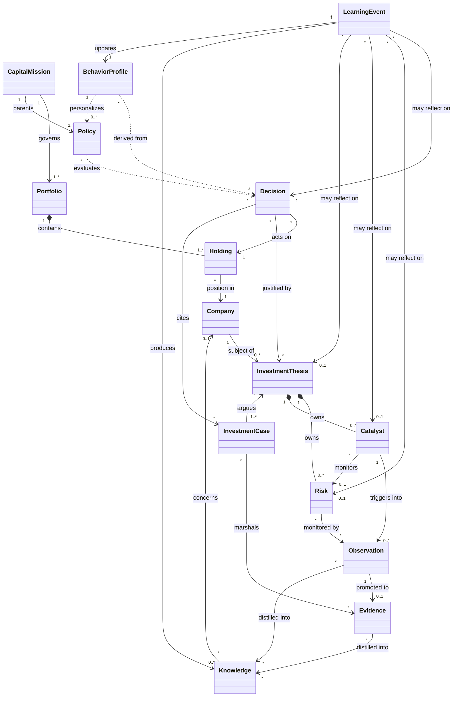

# Canonical Domain Relationships

This document maps how all fifteen canonical domain objects relate to one another: aggregate boundaries, reference directions, and cardinality. It is the authoritative reference for schema design and module ownership. The fifteen objects are: **Portfolio, Holding, Company, Investment Thesis, Investment Case, Evidence, Observation, Knowledge, Decision, Capital Mission, Risk, Catalyst, Learning Event, Behavior Profile, Policy.**

## Aggregate Roots and Owned Entities

Aegis is a modular monolith with strict domain boundaries. The following are **aggregate roots**, each independently persisted and transactionally consistent within its own boundary:

- **Capital Mission** — owns its objective/constraint definition and the parenting relationship to Policies.
- **Portfolio** — owns its collection of Holdings.
- **Company** — a reference/master-data root shared across the system.
- **Investment Thesis** — owns the entities **Risk** and **Catalyst**, which are not independently rooted; their lifecycles are bound to the Thesis.
- **Investment Case** — owns the argument structure that marshals Evidence for or against a Thesis.
- **Evidence** — an independently rooted, sourced fact.
- **Observation** — an independently rooted, unevaluated noted change.
- **Knowledge** — independently rooted institutional understanding.
- **Decision** — an independently rooted, immutable record of a buy/sell/hold/resize choice.
- **Learning Event** — independently rooted reflection record.
- **Behavior Profile** — an independently rooted *derived projection* (one per investor).
- **Policy** — independently rooted governance rule.

Cross-aggregate links are always by **reference (ID)**, never by object containment, and cross-aggregate mutation is coordinated by **domain events**, never by nested writes. The only containment relationships are Portfolio→Holding and Thesis→{Risk, Catalyst}.

## Reference Structure and Cardinality

**Capital Mission → Portfolio (1..N).** A Mission governs one or more Portfolios; a Portfolio is governed by at most one Active Mission. The Mission defines intent; the Portfolio operationalizes it.

**Capital Mission → Policy (1..N).** Each Policy derives from exactly one Mission and must not contradict its constraints.

**Portfolio → Holding (1..N, containment).** A Portfolio is a collection of Holdings; a Holding belongs to exactly one Portfolio and is owned within the Portfolio aggregate.

**Holding → Company (N..1).** Each Holding is a position in exactly one Company; a Company may back many Holdings across many investors' Portfolios. Company is shared master data.

**Company → Investment Thesis (1..N).** A Thesis is a falsifiable belief about why a Company is a good investment; each Thesis references exactly one Company. A Holding is typically justified by one or more Theses on its Company.

**Investment Thesis → Risk (1..N, owned)** and **Investment Thesis → Catalyst (1..N, owned).** Risks enumerate how the Thesis could be wrong; Catalysts enumerate anticipated events that would move it. Both are entities inside the Thesis aggregate.

**Investment Thesis ← Investment Case (1..N).** An Investment Case is an evidence-backed argument supporting or challenging a specific Thesis; each Case references one Thesis. A Thesis may accumulate multiple Cases (bull, bear, updates over time).

**Investment Case → Evidence (N..M).** A Case marshals many Evidence items; a single Evidence item may inform multiple Cases. Evidence is a sourced fact bearing on a Thesis.

**Observation → Evidence (1..1, promotion).** An Observation is an unevaluated noted change; upon evaluation it is promoted into Evidence. Catalysts, when triggered, create Observations, which upon evaluation become Evidence — enforcing the raw-signal → evaluated-fact separation.

**Risk ↔ Observation / Catalyst (monitoring, N..M).** A Risk references the Observations and Catalysts that signal its movement; a Catalyst may reference the Risk it helps monitor.

**Evidence / Observation → Knowledge (N..M, distillation).** Knowledge is distilled from many Evidence items and Observations and retained independently of any single Thesis; a Knowledge unit may supersede a prior one.

**Knowledge → Company (N..1, optional).** Entity-bound Knowledge references the Company (or industry/management) it concerns; Principle-type Knowledge references none.

**Decision → Holding / Portfolio (N..1).** A Decision records a buy/sell/hold/resize choice affecting a Holding within a Portfolio.

**Decision → Investment Thesis / Investment Case (N..M, rationale).** A Decision cites the Theses and Cases that form its reasoning, and draws on Knowledge and current Risk/Catalyst state.

**Policy ⟂ Decision (evaluation, N..M).** Policies are evaluated against each Decision at decision time; each evaluation (permit/warn/override/block) is recorded. Policies also read Portfolio and Holding state.

**Learning Event → {Thesis | Risk | Catalyst | Decision} (N..1, trigger).** Each Learning Event references exactly one trigger source and compares pre-registered expectation to outcome.

**Learning Event → Knowledge (1..N)** and **Learning Event → Behavior Profile (N..1).** Reflection produces or supersedes Knowledge and updates the investor's Behavior Profile.

**Behavior Profile → Investor (1..1); ← Decision, Learning Event, Catalyst, Risk (derivation).** The profile is a deterministic projection over Decision history, Learning Events, and calibration outcomes, and it personalizes Policy.

## Diagram

## Consistency Rules Across Boundaries

1. Deletions are forbidden for auditable objects (Decision, Evidence, Learning Event, Risk, Catalyst once monitored/triggered); they transition to terminal states instead.
2. A ThesisBreaking Risk materializing or a Catalyst resolving against expectation must, via events, flag the parent Thesis for invalidation review — the Thesis aggregate mediates the change.
3. Knowledge and Behavior Profile are the two "memory" surfaces: the former is market/company understanding, the latter is self-understanding. Both are updated only through Learning Events and derivation, never edited ad hoc.
