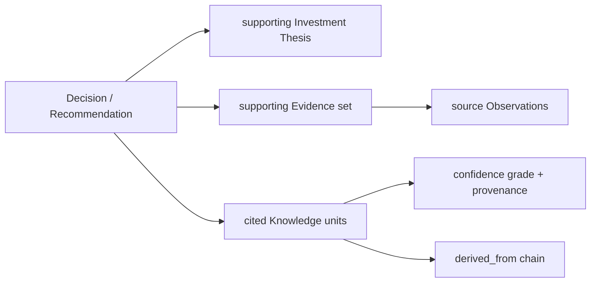

# Architecture: API Design

## Purpose

The API is the contract between the Aegis backend (Python modular monolith) and the web client (TypeScript / Next.js / React), and the eventual contract for any future integration. This document defines the principles that govern that surface: how canonical domain objects map to resources, how the API is versioned, how errors are expressed, and — most importantly for Adaptive Quality Investing — how explainability is made a first-class property of the API rather than an afterthought.

## Style: Resource-Oriented HTTP (REST)

Aegis exposes a **resource-oriented HTTP/JSON API** in the REST tradition. REST is chosen for the same reasons the rest of the stack is chosen: it is ubiquitous, tool-rich, cacheable, and imposes no proprietary contract. The API is the monolith's outer boundary; internal module-to-module communication uses in-process interfaces and domain events (see `event-catalog.md`), never HTTP. The API therefore presents *the platform*, not individual modules — a client sees Aegis, not the Portfolio module talking to the Decisioning module.

## Canonical Objects Map to Resources

API resources are the canonical domain objects, named in the ubiquitous language. There is a deliberate, near-direct correspondence:

```
/portfolios
/portfolios/{id}/holdings
/companies/{id}
/theses/{id}
/investment-cases/{id}
/decisions/{id}
/knowledge/{id}
/capital-missions/{id}
/risks  /catalysts  /learning-events  /behavior-profiles  /policies
```

Principles governing the mapping:

- **Resources are domain objects, not database tables and not UI screens.** A resource is the API projection of an aggregate. Its shape is stable domain vocabulary; it does not leak schema columns, ORM structure, or, critically, any external system's types — an IBKR position is never visible as such; it appears only as a canonical `Holding`.
- **Aggregate boundaries shape URIs.** Holdings are exposed under their Portfolio (`/portfolios/{id}/holdings`) because a Holding belongs to exactly one Portfolio; Knowledge and Company are top-level because they are referenced across many contexts.
- **References are expressed as identities plus links,** so a client can traverse from a Decision to its Thesis to the supporting Evidence without the server pre-joining everything into one opaque blob.
- **Writes are commands against aggregates.** State-changing endpoints correspond to domain operations that preserve invariants (e.g., recording a Decision, attaching Evidence), not arbitrary field patches that could bypass domain rules.

## Versioning

The API is versioned explicitly at the path root (`/v1/...`). Within a major version the contract evolves only in backward-compatible ways: new fields and new resources may be added; existing fields are never removed or repurposed. Clients follow the tolerant-reader rule and ignore unrecognized fields. A breaking change means a new major version served alongside the old until clients migrate. This mirrors the additive-first evolution discipline applied to event and database schemas, giving the whole platform one coherent story about compatibility.

## Error Handling Philosophy

Errors are part of the contract and are designed to be actionable:

- **Standard HTTP status codes carry the class of error** (4xx client, 5xx server), with a **consistent machine-readable body**: a stable `code`, a human-readable `message`, and — where relevant — the specific field or invariant involved.
- **Domain invariant violations are first-class, not generic 500s.** Attempting a Decision that would breach a Policy, or closing a Portfolio that still holds open positions, returns a specific, explainable error naming the violated rule in domain terms.
- **Errors never leak internals.** No stack traces, no ORM detail, no IBKR error payloads surfaced raw — external and infrastructure failures are translated into stable domain-level error codes.
- **Every response is traceable.** Requests and errors carry a correlation identifier propagated through OpenTelemetry, so any client-visible error can be tied to a backend trace.

## Explainability as a First-Class API Concern

This is the principle that most distinguishes the Aegis API. Because the platform's product is *decision quality*, a recommendation or Decision that cannot show its reasoning is architecturally incomplete. The API is therefore designed so that **any reasoning output can return the substrate it rests on.**

Concretely, a Decision or a recommendation resource can be expanded to include its support chain:



- A request for a Decision may include (via an explicit expansion parameter) its governing **Thesis**, the **Evidence** that was weighed, and the **Knowledge** units the AI capability layer cited, each with its confidence grade and `derived_from` provenance.
- The AI capability layer never returns an ungrounded generation across the API; recommendations carry references to the canonical objects that justify them, so the client can render "why" without a second round-trip guessing at rationale.
- Provenance is returned as **references into canonical resources**, not as free text. "Because Knowledge #K-412 (Established) derived from Evidence #E-88 and #E-90" is a traversable answer, not prose — the client can link straight through to each source.

The consequence is that explainability is guaranteed by the shape of the API, not by convention. If a reasoning result exists, its supporting Thesis, Evidence, and Knowledge are addressable through the same API, in the same canonical vocabulary — which is exactly what an investor, or a regulator, or the investor's future self needs in order to trust and audit a decision.
