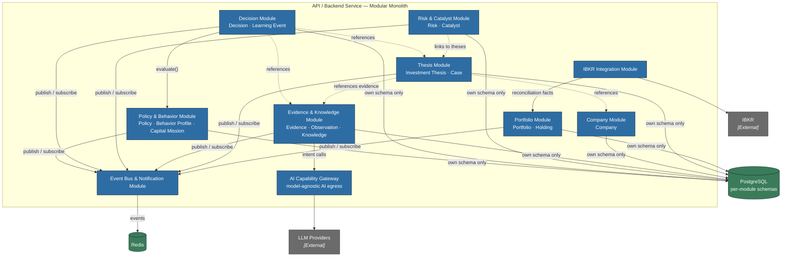

# C4 Level 3 — Component

*Volume IV — System Architecture · Chapter 4*

This chapter opens the **API / Backend Service** container into its internal
**modules** — the components of the Modular Monolith. Each module is a bounded
context aligned to a cluster of canonical domain objects. A module owns its
domain logic, its interface, and its private PostgreSQL schema. Modules
collaborate in exactly two ways: synchronous calls against another module's
published *interface*, and asynchronous *domain events* on the event bus. No
module reads another module's tables, and no module imports another module's
internals. The same modules run inside the Background Workers container; the
API and workers are two runtime faces of one component graph.

## Modules and Responsibilities

- **Portfolio Module** — owns **Portfolio** and **Holding**. Maintains the
  investor's reconciled positions, cost basis, weights, and exposure. Consumes
  reconciliation facts from the IBKR Integration module and publishes events
  such as `HoldingReconciled` and `PositionChanged`. It is the authority on
  *what the investor owns*.

- **Thesis Module** — owns **Investment Thesis** and **Investment Case**. Manages
  the investor's structured reasoning about a **Company**: the case for holding,
  its key assumptions, and its lifecycle state (draft, active, challenged,
  invalidated). It references Evidence and Observations by identity but does not
  store them. It is the authority on *why the investor holds a position*.

- **Company Module** — owns **Company** reference data: identity, classification,
  and the canonical record that theses, holdings, and evidence attach to. It
  normalizes external company data into stable internal identities so that other
  modules never depend on a vendor's identifiers.

- **Evidence & Knowledge Module** — owns **Evidence**, **Observation**, and
  **Knowledge**. Ingests raw material (filings, fundamentals, news) and refines
  it: Evidence is a captured fact with provenance; an Observation is an
  interpretation (often AI-assisted); Knowledge is durable, curated
  understanding. It is the primary caller of the AI Capability Gateway and the
  custodian of provenance — the backbone of explainability. It publishes
  `EvidenceCaptured`, `ObservationRecorded`, and `KnowledgeUpdated`.

- **Risk & Catalyst Module** — owns **Risk** and **Catalyst**. Tracks what could
  invalidate a thesis (risks) and what could confirm or trigger it (catalysts),
  linking each to the theses and holdings it bears on, and raising events when a
  catalyst window opens or a risk materializes.

- **Decision Module** — owns **Decision** and **Learning Event**. Records the
  investor's decisions with full provenance — the thesis served, the evidence
  weighed, the policies checked, the AI observations consulted — and captures
  Learning Events that feed reflection. It is deterministic: it records and
  enforces, it does not predict. It is the authority on *what was decided and
  why*, and the anchor of the audit trail.

- **Policy & Behavior Module** — owns **Policy**, **Behavior Profile**, and
  **Capital Mission**. Encodes the investor's rules and disposition (position
  limits, diversification constraints, temperament guardrails) and the mission
  their capital serves. It evaluates proposed decisions against policy
  deterministically and raises `PolicyBreachDetected` when guardrails are
  crossed.

- **AI Capability Gateway** — the sole egress to LLM Providers. Exposes
  intent-shaped operations (`summarizeEvidence`, `extractCatalysts`,
  `draftObservation`) rather than provider APIs, routes to a configured provider
  behind a model-agnostic adapter interface, and records model, version, prompt,
  and inputs for every call. It returns proposals as data; it never writes
  domain state. This is the quarantine boundary for non-determinism.

- **IBKR Integration Module** — the sole adapter to Interactive Brokers.
  Translates broker positions and transactions into internal reconciliation
  facts for the Portfolio module and routes explicitly authorized actions
  outbound. Vendor specifics stop here.

- **Event Bus & Notification Module** — provides the in-process publish/subscribe
  contract, carried over Redis between the API and workers, through which all
  domain events flow. It also owns outbound Notifications, translating selected
  domain events into investor alerts.

## Component Diagram

Solid arrows are synchronous interface calls; dashed arrows are references by
identity resolved through interfaces; publish/subscribe edges are asynchronous
domain events. Notice the shape of a decision: the **Decision Module** calls the
**Policy & Behavior Module** synchronously to evaluate guardrails, references the
**Thesis** and **Evidence** it rests on, and records provenance — while all
AI involvement reached the domain earlier, as reviewable Observations produced
through the **AI Capability Gateway**. Determinism lives in the core;
non-determinism is confined to the gateway. Chapter 5 specifies the rules these
edges must obey.
