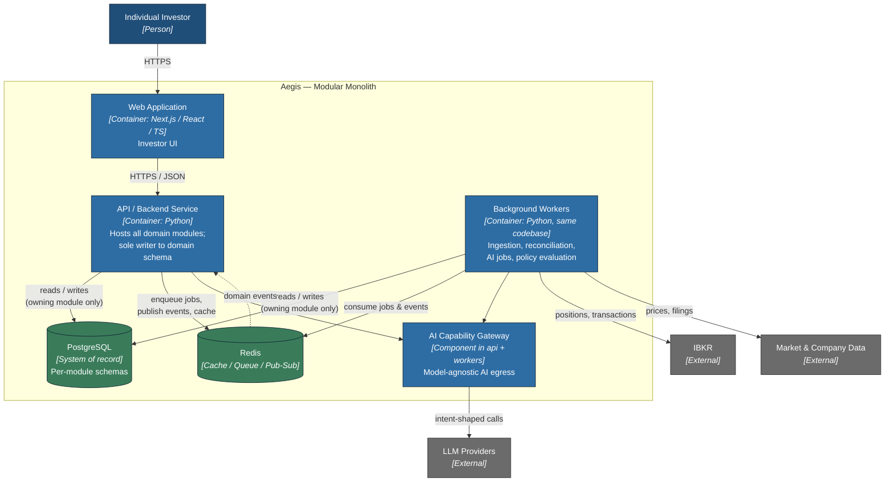

# C4 Level 2 — Container

*Volume IV — System Architecture · Chapter 3*

This chapter opens the Aegis system box into its **containers** — the separately
runnable, separately deployable units and the data stores they depend on. In C4
terms a container is a thing that runs (a process, an app, a database), not a
Docker container specifically, though every Aegis container is packaged and run
via Docker in all environments. The domain modules *inside* the backend are the
subject of Chapter 4; here we stay at the deployment altitude.

Aegis is a **Modular Monolith**. The domain logic lives in one codebase and, at
runtime, in two process shapes that share it: a synchronous API service and an
asynchronous worker pool. This gives us a single source of domain truth and
simple local reasoning, while the strict internal boundaries (Chapter 5) keep
the option of later extraction open.

## Containers

- **Web Application** — TypeScript + Next.js + React. The investor-facing UI and
  its server-side rendering layer. It renders portfolios, theses, evidence, and
  decisions, and calls the backend exclusively over HTTPS/JSON. It holds no
  domain logic and no direct database or LLM access; it is a presentation and
  interaction tier only.

- **API / Backend Service** — Python. The heart of the system: it hosts every
  domain module (Portfolio, Thesis, Evidence/Knowledge, Decision, Risk &
  Catalyst, Policy & Behavior, and the integration/gateway modules) behind a
  synchronous HTTP API. It handles investor requests, orchestrates in-process
  calls across module interfaces, publishes and consumes domain events, and is
  the sole writer to the domain schema in PostgreSQL. This is where the
  Modular Monolith physically lives.

- **Background Workers** — Python, the *same* codebase as the API service, run in
  a worker role. They execute asynchronous and scheduled work: ingesting market
  and company data, reconciling IBKR positions, running AI capability jobs
  (summarization, extraction), evaluating policies, and reacting to domain
  events. Sharing the codebase means workers call the identical domain modules
  the API does — there is no divergent "batch" domain logic.

- **PostgreSQL** — the system of record. Every module owns a private schema; no
  module reads or writes another module's tables. All authoritative Aegis domain
  state — Portfolios, Holdings, Theses, Cases, Evidence, Decisions, Policies,
  and the provenance that makes them explainable — persists here.

- **Redis** — cache, queue, and pub/sub substrate. It backs the background job
  queues, transports domain events between the API and workers, and caches hot
  read data (e.g. market snapshots). Redis is infrastructure, never a system of
  record; anything that must survive is in PostgreSQL.

- **AI Capability Gateway** — a Python module, deployed *inside* the backend and
  worker processes, that is the single egress point to all LLM Providers. It is
  called out as a first-class container concern because it is the only component
  permitted to talk to external models, it enforces model-agnostic
  intent-shaped operations, and it records model, version, prompt, and inputs
  for every call to satisfy explainability. It is designed so that, should an
  ADR ever justify it, it can be extracted into its own service with no change
  to its callers.

## Container Diagram

## Communication Rules

Communication between containers follows a small, enforced set of patterns.
**Web → API** is synchronous HTTPS/JSON; the web tier never touches PostgreSQL,
Redis, or LLMs directly. **API ⇄ Workers** never call each other over the
network; they collaborate *asynchronously* through domain events and job queues
carried on Redis, which keeps request latency independent of background load.
**Any container → PostgreSQL** obeys the ownership rule — a module's code touches
only its own schema, so "shared database" coupling cannot arise even though one
database instance serves the monolith. **Any container → LLM Providers** is
impossible except through the AI Capability Gateway.

Two consequences matter. First, the API and workers scale independently even
though they share code: investor-facing latency is isolated from ingestion and
AI throughput. Second, because events already carry cross-module facts over
Redis, extracting a module into its own service later becomes a transport change
at a boundary that already exists — not a re-architecture. Chapter 4 descends
into those modules.
