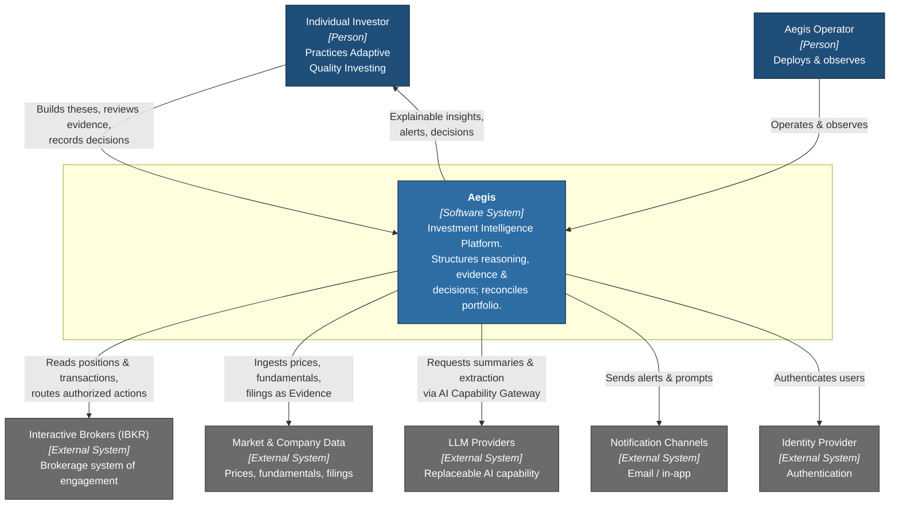

# C4 Level 1 — System Context

*Volume IV — System Architecture · Chapter 2*

This chapter fixes the outer boundary of Aegis: who uses it, what it depends on,
and where responsibility ends. It is the first of the C4 progression
(Context → Container → Component). At this altitude Aegis is a single black box;
we care only about the actors around it and the direction of trust and data.

## The System

**Aegis** is an Investment Intelligence Platform for individual investors
practicing Adaptive Quality Investing. Its purpose is to raise the *quality* of
investment decisions — the reasoning, evidence, and discipline behind them —
rather than to predict prices. It maintains the investor's Portfolio and
Holdings, structures their reasoning as Investment Theses and Cases supported by
Evidence and Observations, tracks Risks and Catalysts, records Decisions and
Learning Events, and enforces the investor's own Policies and Behavior Profile.
In V1 its scope is long-term public equities only; the boundary is drawn so that
future capital-allocation domains can be added without redrawing it.

## Actors

- **Individual Investor (primary user).** The human decision-maker. They
  construct theses, review Aegis-surfaced evidence and observations, record
  decisions, and manage their portfolio and policies. Aegis advises and
  organizes; the investor decides. Every recommendation is explainable and
  traceable back to its evidence.
- **Aegis Operator (supporting user).** Internal engineering and operations
  staff who deploy, observe, and maintain the platform. They interact through
  operational tooling and telemetry, not through investor-facing features.

## External Systems

Aegis integrates with external systems strictly through adapters at its edge.
Each is replaceable; none is allowed to leak its vendor shape into the domain.

- **Interactive Brokers (IBKR).** The system of engagement for brokerage. Aegis
  reads authoritative account positions, holdings, and transactions from IBKR to
  reconcile the investor's Portfolio, and — where in scope — routes actions the
  investor has explicitly authorized. IBKR is the source of brokerage truth;
  Aegis's Portfolio is a reconciled projection, and PostgreSQL remains the
  system of record for Aegis's own domain state.
- **Market & Company Data Providers.** External feeds supplying prices,
  fundamentals, filings, corporate actions, and company reference data. These
  become Evidence and Observations inside the domain after passing through
  normalization adapters. Multiple providers are anticipated; the abstraction
  keeps any one of them swappable.
- **LLM Providers (replaceable external capability providers).** Third-party
  large-language-model services accessed *only* through the AI Capability
  Gateway. They are treated as interchangeable external capabilities — never a
  hardcoded dependency of any module. They summarize evidence, extract structure
  from documents, and draft observations; they never mutate domain state
  directly. Any provider can be added, routed to, or removed by configuration.
- **Notification / Delivery Channels.** Outbound channels (email and in-app) for
  alerts on catalysts, risks, policy breaches, and learning prompts.
- **Identity Provider.** Authentication of investors and operators at the system
  edge.

## Context Diagram

## Boundary Commitments

Three commitments hold this boundary firm. First, **Aegis owns its domain
truth**: external systems inform the domain but do not define it; PostgreSQL is
the system of record and every external fact enters as reconcilable Evidence or a
projection. Second, **every external system sits behind an adapter**, so vendor
churn is an edge concern, never a domain concern. Third, **LLM providers are
capabilities, not dependencies** — reachable only through the AI Capability
Gateway, consistent with the model-agnosticism principle. Chapter 3 opens the
box into its deployable containers.
