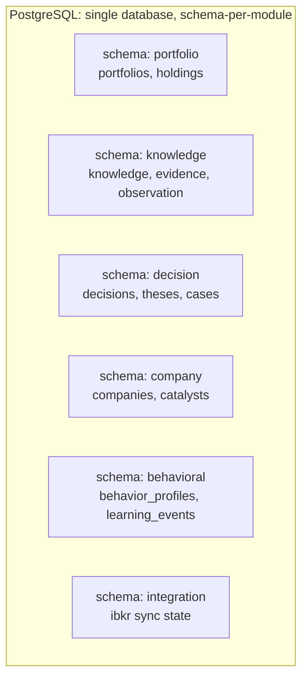

# Architecture: Data Architecture

## Purpose

This document defines how Aegis persists and moves data in a way that honors the modular monolith's strict domain boundaries. Two stores carry the load: **PostgreSQL** as the system of record for all authoritative domain state, and **Redis** as the volatile tier for caching, work queues, and the internal domain-event bus. The governing principle is that data ownership follows module ownership: a module's canonical objects are its private property, and no other module reaches into that data directly.

## PostgreSQL as System of Record

PostgreSQL holds the durable truth of the platform. Every canonical domain object — Portfolio, Holding, Company, Investment Thesis, Investment Case, Evidence, Observation, Knowledge, Decision, Capital Mission, Risk, Catalyst, Learning Event, Behavior Profile, Policy — is persisted here, and PostgreSQL is the only tier from which correctness may be reconstructed. Redis is always disposable; PostgreSQL never is.

### Schema per module

Domain boundaries are enforced physically through **per-module PostgreSQL schemas** (namespaces within a single database). Each module — Portfolio, Knowledge, Decisioning, Company/Reference, Behavioral, Integration, and so on — owns exactly one schema and the tables within it.

The rules that make this a boundary rather than mere tidiness:

- A module reads and writes **only its own schema**. Cross-schema foreign keys are prohibited; a module references another module's aggregate by storing that aggregate's identity as an opaque value, never by joining across schemas.
- Cross-module consistency is achieved through **domain events** (see `event-catalog.md`), not through distributed transactions or shared tables. Within a module, an aggregate's invariants are enforced in a single local transaction.
- The single-database, multi-schema layout keeps V1 operationally simple (one backup target, one connection pool discipline, one migration runner) while preserving the option to lift any schema into its own database — and eventually its own service — with minimal disruption. This is the data-tier expression of the "extract a module later only if justified" stance.

### Ownership discipline

Ownership is unambiguous and singular. The Portfolio module owns `portfolios` and `holdings`. The Knowledge module owns `knowledge`, `evidence`, and `observation`. The Decisioning module owns `decisions`, `theses`, and `investment_cases`. Reference data about public companies lives in the Company module. A Holding referencing a Company stores the Company's identity, and if it needs Company attributes it obtains them through the Company module's interface — never by querying the `company` schema directly. This is what allows a module's internal storage to be refactored without coordinating with the rest of the system.

Derived and aggregate values (total portfolio value, exposure, performance) are computed by the owning module from its authoritative rows; they are not stored as competing sources of truth in other modules.

## Redis as the Volatile Tier

Redis carries state that is valuable but reconstructible. It is used in three distinct roles, kept conceptually separate:

- **Caching.** Read-heavy, expensive-to-compute results — resolved Company reference data, rendered portfolio aggregates, Knowledge retrieval results serving the AI capability layer — are cached with explicit TTLs and clear invalidation rules driven by domain events. A cache miss must always be answerable from PostgreSQL.
- **Queues.** Asynchronous and background work — IBKR synchronization jobs, Knowledge synthesis triggered by Learning Events, notification dispatch — is enqueued in Redis so that request-path latency is decoupled from long-running processing.
- **Pub/sub for domain events.** Redis provides the in-process-plus-cross-process transport for the internal event bus, letting the Decisioning module react to a `Holding.Acquired` event published by the Portfolio module without either module calling the other synchronously.

Because Redis is disposable, no invariant may depend on it. If Redis is flushed, the platform must recover by rebuilding caches on demand and by relying on durable outbox state in PostgreSQL for any event that must not be lost. Events with delivery guarantees are written to a per-module outbox table inside the same local transaction as the state change, then relayed to Redis — so a Redis failure delays delivery but never drops a committed event.

## Backup and Migration Philosophy

At the level of principle, not DDL:

- **PostgreSQL is backed up as the whole truth.** Point-in-time recovery is the target: continuous archiving so any moment can be reconstructed, plus periodic full snapshots. Backups are verified by restore drills, not assumed. Because Knowledge and its supersession chains are append-only institutional memory, backup retention treats historical state as permanently valuable, not as churn to be aged out.
- **Redis is not backed up as truth.** It may use lightweight persistence to accelerate warm restarts, but recovery correctness always assumes a cold, empty Redis.
- **Migrations are versioned, forward-only, and per-module.** Each module owns its schema's migration history; migrations are additive-first (expand, then contract) so that a rolling deploy never leaves running code addressing a column that no longer exists. Backwards-incompatible schema changes follow the same expand/migrate/contract discipline used for event schemas, preserving zero-downtime deploys.
- **Data at rest respects the boundary.** Every migration touches exactly one module's schema; a change that appears to require editing two schemas at once is a signal that a boundary is being violated and must be re-expressed as an event-driven flow.

The result is a data tier that is simple to operate today, safe to evolve, and pre-shaped for the day a module must become a service — because ownership, transactions, and truth already live where that module lives.
