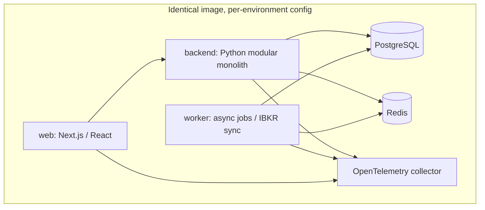

# Architecture: Deployment

## Purpose

This document defines the principles governing how Aegis is packaged and run across environments. The objective is **environment parity through containerization**: local, dev, staging, and production run the same images configured differently, so that "works on my machine" and "works in production" converge. Deployment is Docker-based, aligned to the container-level units of the C4 model, configured through the environment, and observable through mandatory health checks.

## Docker-Based Environments and Parity

Every runnable unit of Aegis is a Docker container. The same image that a developer runs locally is the image that runs in staging and production — promoted, not rebuilt per environment. What differs between environments is **configuration and scale**, never the artifact.

- **Local**: Docker Compose brings up the full topology on a developer's machine with seeded data. A developer exercises the real web app against the real backend against real PostgreSQL and Redis — not mocks.
- **Dev / staging**: the same compose-or-orchestrated topology with production-shaped configuration, used for integration testing and pre-release validation.
- **Production**: the same images, hardened configuration, real backups, and production observability.

Parity is a hard principle: any dependency that exists in production (PostgreSQL, Redis, the OpenTelemetry collector) must exist in local and staging too. No environment may rely on a component the others lack.

## Containerization Aligned to the C4 Model

Containers map one-to-one to the **container-level units** of the C4 architecture, honoring the modular monolith's boundaries:

- **web** — the Next.js / React application serving the UI.
- **backend** — the Python modular monolith exposing the HTTP API. The monolith is a single deployable unit; its internal module boundaries are logical (schemas, interfaces, events), not separate containers. This is the point of the modular monolith — one thing to deploy, many boundaries inside.
- **worker** — a Python process running from the *same backend image* but started in worker mode, draining the Redis job queue (IBKR sync, Knowledge synthesis, notifications). Sharing the image guarantees the worker and API run identical domain code.
- **PostgreSQL** — the system of record.
- **Redis** — cache, queues, and the domain-event bus.
- **OpenTelemetry collector** — receives traces, metrics, and logs from every service.

Should a module ever be extracted into a service (see `event-catalog.md`), it becomes an additional container behind the same conventions; nothing about the deployment model has to be reinvented to allow it.

## Environment Configuration Philosophy

Configuration follows twelve-factor discipline: **config lives in the environment, not in the image.**

- Images are built once and carry no environment-specific values. Connection strings, credentials, feature flags, the active AI capability-layer provider binding, and IBKR endpoints are all injected as environment variables/secrets at run time.
- Because the AI layer is model-agnostic, provider selection is *configuration* — swapping the underlying LLM provider is an environment change, never a code change or a rebuild.
- Secrets are supplied through the platform's secret mechanism and never baked into images, committed, or logged. IBKR credentials in particular live only in the Integration container's runtime environment.
- Configuration is validated at startup: a container that is missing or misconfiguring a required value **fails fast and loudly** rather than starting in a degraded, silently-wrong state.

## Health-Check Expectations

Every container exposes health signals so the orchestrator and operators can reason about readiness and liveness:

- **Liveness** — "the process is alive and not deadlocked." Failing liveness triggers a restart.
- **Readiness** — "the process can serve traffic *and* its critical dependencies are reachable." The backend's readiness check confirms it can reach PostgreSQL and Redis; the worker's confirms it can reach the queue. A container that is alive but not ready is kept out of rotation rather than handed traffic it cannot serve.
- **Dependency awareness** — readiness distinguishes hard dependencies (PostgreSQL: not ready without it) from soft ones (a degraded IBKR feed makes sync stale, per `ibkr-integration.md`, but must not mark the whole backend unready — the domain still serves last-known-good state).
- **Observability-backed** — health, and everything around it, is instrumented through OpenTelemetry so that startup, readiness transitions, and restarts are visible as traces and metrics, not guessed at from logs.

## Summary

Aegis deploys as a small set of Docker containers mapped to C4 container units, promoted as identical images across environments that differ only in injected configuration, with fail-fast config validation and liveness/readiness checks on every unit. The model is deliberately simple for a modular monolith — one backend image serving both API and worker, backed by PostgreSQL and Redis, observed through OpenTelemetry — and it is shaped so that scaling out or extracting a service later requires more containers, not a new deployment philosophy.
