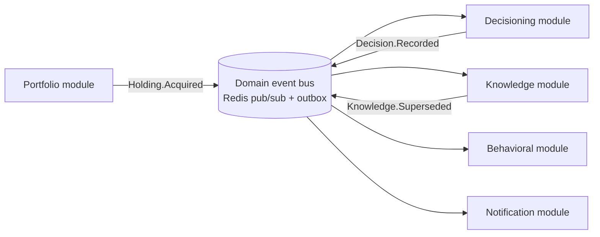

# Architecture: Domain Events and the Event Catalog

## Purpose

Aegis is an event-driven modular monolith. Domain events are the sanctioned mechanism by which one module reacts to something that happened in another without depending on that module's internals. This document defines the architectural role of events, the conventions that keep them a durable contract, and how disciplined event design preserves the option to extract a module into a standalone service if — and only if — that is ever justified.

The platform deliberately does **not** adopt event sourcing or CQRS in V1. Events are a decoupling and integration mechanism layered over aggregates that persist their own current state in PostgreSQL. They are not the system of record and are not replayed to reconstruct aggregate state.

## The Architectural Role of Events

A domain event is an immutable statement of fact: *something meaningful happened in the domain, expressed in canonical terms.* `Holding.Acquired`, `Thesis.Invalidated`, `Decision.Recorded`, `Knowledge.Superseded`, `LearningEvent.Synthesized` — each describes a completed change to a canonical object, in that object's own vocabulary.

Events exist to invert dependencies. Without them, the Decisioning module would call the Portfolio module, the Knowledge module would call Decisioning, and the boundaries drawn in the domain model would erode into a call graph. With events, the module that *causes* a change publishes a fact and knows nothing about who consumes it; the module that *needs to react* subscribes and knows nothing about who produced it.

The result is that a module's public surface is (a) its callable interface for synchronous queries and commands, and (b) the events it publishes. Everything else is private.

## Publishing and Consuming Internally

Events are produced and consumed through a **transactional outbox**. When a module commits a state change to its PostgreSQL schema, it writes the corresponding event(s) to an outbox table **in the same local transaction**. A relay then publishes committed outbox rows to the Redis pub/sub bus. This guarantees that an event is emitted if and only if the state change it describes actually committed — no lost events, no phantom events.

Consumers subscribe by event type and handle events **idempotently**: each event carries a unique identifier, and handlers must tolerate redelivery without duplicating effects. Consumption is asynchronous by default — the publisher never blocks on consumers — which keeps the request path fast and keeps a slow or failing consumer from breaking the producer. A consumer that falls behind or errors retries from its own position; it cannot corrupt the producing module's state, because it can only react to facts, never reach back into the producer's data.

Ordering guarantees are scoped per aggregate: events about a single Holding are delivered in the order they occurred; no global ordering across the whole system is assumed or required.

## Naming Conventions

Event names are stable, canonical, and past-tense, following `AggregateName.PastTenseFact`:

- `Portfolio.Created`, `Holding.Acquired`, `Holding.Increased`, `Holding.Exited`
- `Thesis.Drafted`, `Thesis.Confirmed`, `Thesis.Invalidated`
- `Decision.Recorded`, `Decision.Reviewed`
- `Evidence.Attached`, `Observation.Noted`, `Knowledge.Established`, `Knowledge.Superseded`
- `LearningEvent.Synthesized`, `Risk.Flagged`, `Catalyst.Triggered`

Rules: the aggregate segment is always a canonical domain object (never an IBKR type or an infrastructure concept); the verb is past tense because an event is a fact that already happened; names describe *domain* meaning, never mechanism (`Holding.Acquired`, not `HoldingRowInserted`). This naming is itself part of the ubiquitous language — an event name that would confuse a domain expert is wrong.

## Versioning Philosophy

Event schemas are a contract between modules and are versioned as such:

- Every event payload carries an explicit **schema version** and a stable event identifier.
- Evolution is **additive and backward-compatible by default**: new optional fields may be added freely; existing fields are never removed or repurposed in place. Consumers must ignore fields they do not recognize (tolerant reader).
- A genuinely breaking change publishes a **new version alongside the old** (e.g., `Holding.Acquired` v2), and producers emit both until every consumer has migrated; only then is the old version retired. This mirrors the expand/migrate/contract discipline used for database schemas.
- Payloads are expressed in canonical domain terms and carry identities and values, not internal storage representations, so the contract does not leak a module's private structure.

## Enabling Future Service Extraction

The discipline above is precisely what keeps a future extraction cheap. Because modules already communicate only through published events and explicit interfaces — never through shared tables or cross-schema joins — the seam along which a module would be cut already exists. Extracting the Knowledge module into a service would mean moving its schema to its own database and replacing the in-process Redis bus with a network transport for the same event contracts; the *names, payloads, and semantics* of the events do not change, and neither producers nor consumers need to be rewritten.

This is the payoff of investing in event rigor while still a monolith: the architecture earns the ability to distribute later without paying the operational cost of distribution now. Events keep the monolith modular, and modularity keeps extraction optional.
