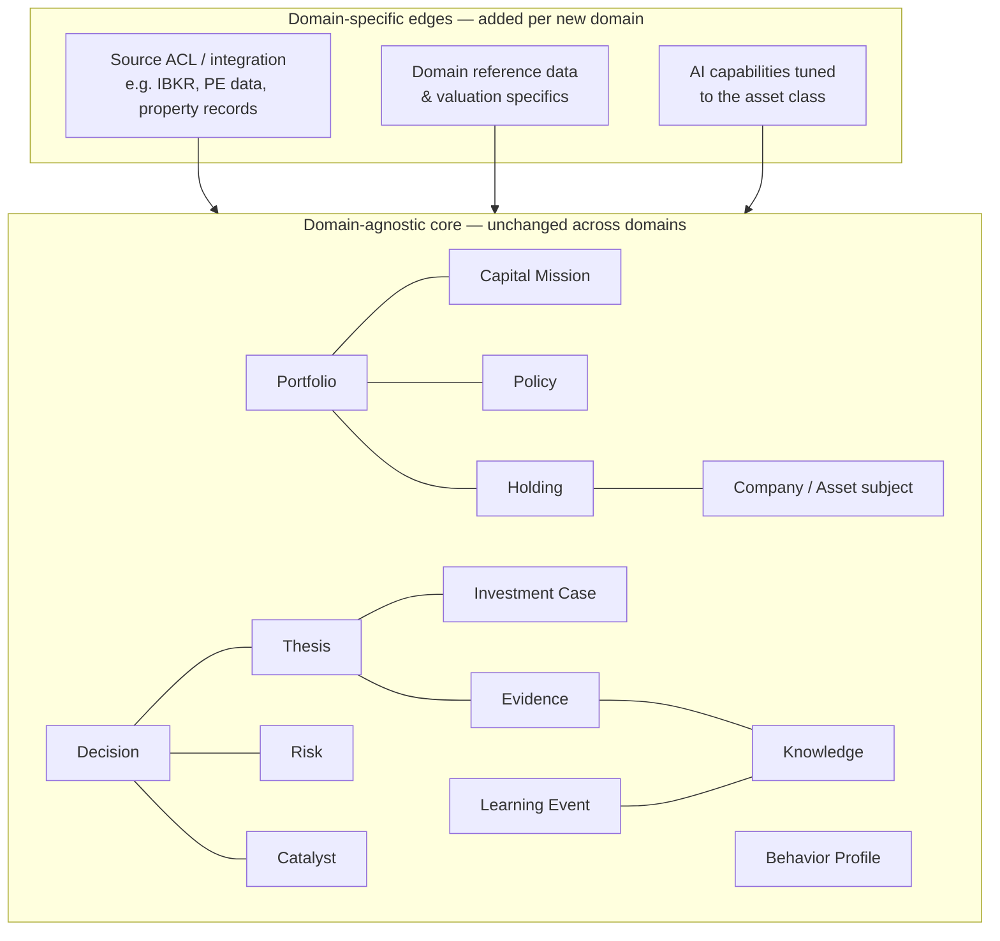

# Architecture: Extensibility to Future Capital-Allocation Domains

## Purpose

Aegis V1 addresses long-term public equities, but the platform is explicitly a general **capital-allocation intelligence** system. This document specifies how the architecture is designed to extend to future domains — Private Equity, Venture Capital, Real Estate, Corporate Capital Allocation, Strategic Procurement — **without a rewrite**. It states precisely which parts of the domain model and module boundaries are domain-agnostic by design, what would need to change to add a new context, and, just as importantly, what would *not*.

## The Core Insight: Capital Allocation Is the Domain

The canonical objects were chosen so that the *invariant* concept is not "stock" but "capital deployed toward objectives under quality-graded reasoning." A public equity position and a real-estate acquisition and a procurement commitment are all the same shape at the level Aegis reasons about: capital committed toward a **Capital Mission**, expressed as **Holdings** within a **Portfolio**, justified by an **Investment Thesis** and **Investment Case**, supported by **Evidence** and **Knowledge**, enacted through a graded **Decision**, exposed to **Risk** and **Catalyst**, and refined by **Learning Events** against a **Behavior Profile** under governing **Policy**.

That is why the canonical model contains no equities-specific concept. "Ticker," "dividend," and "earnings call" appear nowhere in the domain vocabulary. The V1 equity specialization lives at the *edges* — the IBKR integration and equity-specific reference data — not in the core.

## What Is Domain-Agnostic by Design

- **The canonical objects and their relationships.** Portfolio, Holding, Company (as a generalizable *asset/subject* reference), Thesis, Case, Evidence, Observation, Knowledge, Decision, Capital Mission, Risk, Catalyst, Learning Event, Behavior Profile, and Policy carry no equity-specific semantics. A VC investment is a Holding referencing a subject; its Thesis, Evidence, and Decision work identically.
- **The module boundaries.** Portfolio, Decisioning, Knowledge, Behavioral, and their event contracts are drawn around *capital-allocation* responsibilities, not asset classes. `Holding.Acquired`, `Thesis.Invalidated`, `Decision.Recorded`, and `Knowledge.Established` are meaningful in any domain.
- **The Knowledge layer.** Confidence-graded, source-attributed, supersession-tracked understanding is domain-neutral by construction. The subject of a Knowledge unit may be a public company, a private company, a property market, or a supplier — the machinery of accumulating and citing understanding is identical.
- **The AI capability layer.** Model-agnostic *and* domain-neutral in its contract: it reasons over Knowledge and canonical objects. Its interface does not change when the asset class does.
- **The anti-corruption pattern.** Every external source is translated at a boundary into canonical objects. IBKR is the first instance of a reusable pattern, not a special case.
- **The infrastructure.** PostgreSQL schema-per-module, Redis, the event bus, the API's resource model, deployment, and observability are all indifferent to which capital-allocation domain is active.

## What Would Change to Add a New Domain

Adding, say, Real Estate or Private Equity is an **additive** exercise at the edges:

1. **A new source integration (ACL).** Each domain has different data origins — property records, cap tables, procurement systems — so a new adapter+translator is written to map that source into canonical Holdings, subjects, and Portfolios. This mirrors the IBKR ACL exactly; the domain never sees the source's native types.
2. **Domain-specific reference data and valuation specifics.** How an asset is identified and valued differs by domain. This is captured as a new reference/valuation concern behind an interface the domain consumes — extending the "Company/subject" reference, not altering the core objects that point at it.
3. **AI capabilities tuned to the asset class.** New evaluation prompts, retrieval emphases, or specialist capabilities may be registered *within* the existing model-agnostic capability layer. The abstraction stays; new capabilities plug into it.
4. **Domain-appropriate Policy and Risk/Catalyst vocabularies.** Policies, Risks, and Catalysts take on domain-specific *content* (an illiquidity Risk for PE, a lease-rollover Catalyst for real estate), but they instantiate the same canonical constructs — no new object types.

Each of these is a new module or a new implementation behind an existing interface. None requires editing the shared core.

## What Would *Not* Change

- The canonical object set and their invariants.
- The module boundaries and their event contracts.
- The Knowledge layer's accumulation pipeline and query surface.
- The AI capability layer's model-agnostic interface.
- The data architecture, event system, API resource model, deployment topology, and observability.

If adding a new capital-allocation domain ever demanded changing the canonical objects or the module boundaries, that would be a signal the abstraction had leaked — a defect to correct, not an expected cost. The architecture's promise is that a new domain arrives as a new set of edges around an unchanged core.

## Consequence

Because specialization is confined to integrations, reference/valuation data, and pluggable AI capabilities — while the capital-allocation core, Knowledge layer, and infrastructure remain fixed — Aegis can grow from public equities into an entire family of capital-allocation contexts by *extension*, never by rewrite. This is the structural expression of the founding claim: Aegis reasons about decision quality in the deployment of capital, and that reasoning is the same shape wherever capital is deployed.
