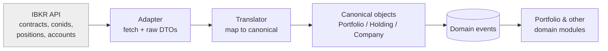

# Architecture: Interactive Brokers Integration

## Purpose

Interactive Brokers (IBKR) is the V1 source of real position and account data. This document specifies how that external system is integrated **without allowing it to shape or corrupt the domain**. The controlling pattern is an **Anti-Corruption Layer (ACL)**: a translation boundary that consumes IBKR's data model and emits canonical domain objects — **Holding**, **Company**, **Portfolio** — such that no code beyond the boundary ever sees an IBKR type. IBKR is an implementation detail of *where the data came from*, never a participant in domain logic.

## The Anti-Corruption Layer

IBKR has its own vocabulary and structure: contracts, conids, account summaries, position rows, execution reports, corporate-action feeds. That vocabulary is optimized for a brokerage's concerns, not for Adaptive Quality Investing. If it leaked inward, the domain would slowly reshape itself around a broker's model — coupling the platform to IBKR and undermining the goal of generalizing to future capital-allocation domains.

The Integration module isolates IBKR behind an ACL with three responsibilities:

1. **Adapter** — speaks IBKR's protocol, handles auth and session, and produces raw, IBKR-shaped data transfer objects. This is the *only* code permitted to know IBKR's types.
2. **Translator** — maps raw IBKR DTOs into canonical domain objects. An IBKR position becomes a **Holding** referencing a **Company**; the IBKR account maps to a **Portfolio**. Identifiers are translated from IBKR's `conid` space into Aegis Company identities via an explicit, persisted crosswalk.
3. **Publisher** — commits translated results and emits canonical domain events (`Holding.Acquired`, `Holding.Increased`, `Holding.Exited`) so the Portfolio and downstream modules react through the normal event bus, unaware IBKR was involved.

## Why Raw IBKR Types Must Never Leak

The rule is absolute: **IBKR types stop at the Translator.** No IBKR DTO, field name, enum, or error object may appear in the Portfolio module, the Decisioning module, the Knowledge layer, the API, or the web client. The reasons are architectural, not stylistic:

- **Substitutability.** V1 is IBKR; the architecture must generalize to other brokers and, eventually, to entirely different capital-allocation domains. If the domain speaks canonical Holdings, a second broker is just a second adapter+translator behind the same boundary. If the domain spoke `conid`, every future source would be a rewrite.
- **Domain integrity.** Invariants (a Holding belongs to exactly one Portfolio; a Company identity is stable) are the domain's to enforce. A leaked broker model would smuggle in a foreign notion of identity and correctness.
- **Blast-radius control.** IBKR API changes are contained to the adapter. When IBKR revises its contract model, exactly one component changes; the domain does not notice.

The crosswalk between IBKR identifiers and canonical Company identities lives *inside* the Integration module and is never exposed outward. Downstream code asks about a Company; it never asks about a `conid`.

## Sync Strategy (Principles)

Synchronization is treated as **reconciliation toward canonical truth**, not as remote control of domain state:

- **IBKR is a source, PostgreSQL is the record.** Sync reads IBKR and reconciles it into canonical objects; the domain's PostgreSQL state remains the system of record. The domain is never a live mirror that breaks when the feed does.
- **Scheduled + event-driven pulls.** Positions and account data are refreshed on a schedule via the Redis-backed job queue, with on-demand refresh available. Aegis pulls; it does not depend on IBKR pushing.
- **Idempotent reconciliation.** Each sync computes the delta between IBKR's reported state and current canonical Holdings and emits only the domain events that represent genuine change. Re-running a sync produces no spurious events — the same discipline of idempotency used across the event system.
- **Translation is validated.** Data that cannot be confidently mapped (an unknown instrument, a missing crosswalk entry) is quarantined for review inside the Integration module rather than being force-fit into a Holding. A bad map never silently creates wrong domain state.

## Failure-Handling Philosophy

The integration is designed so that **IBKR unavailability degrades gracefully and never corrupts the domain**:

- **Outages are non-corrupting.** If IBKR is unreachable or returns partial data, the sync **aborts without mutating** canonical state. Absence of a fresh pull is never interpreted as "the position was closed." Deletions and exits require positive confirmation from a successful, complete sync, not the mere absence of data.
- **Last-known-good is explicit.** Canonical Holdings carry the timestamp of their last successful reconciliation, so the platform (and the investor) can see data staleness rather than being misled by silence.
- **Retries and backoff live in the adapter.** Transient failures are retried behind the boundary; persistent failures raise an operational signal (surfaced via OpenTelemetry) but leave domain state untouched.
- **Errors are translated too.** IBKR error payloads are mapped to stable, domain-level integration statuses. Raw broker errors never propagate to the API or the domain, consistent with the API error-handling philosophy.

The net effect: IBKR is a well-contained, replaceable source of truth-about-positions, translated once at the boundary into canonical objects, and structurally incapable of dictating or damaging the domain it feeds.
