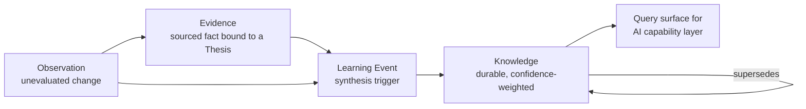

# Architecture: The Knowledge Layer

## Purpose

The Knowledge layer is the component of the Aegis architecture responsible for accumulating durable, structured understanding from transient inputs and serving that understanding to the reasoning system in an explainable form. It is the architectural home of the canonical **Knowledge** object, and the place where **Evidence**, **Observation**, and **Learning Event** are refined into institutional memory. It exists so that Adaptive Quality Investing can compound understanding, not merely store facts.

This layer is deliberately distinct from raw data storage. Data architecture (see `data-architecture.md`) concerns itself with durably persisting records — a bytes-in, bytes-out contract. The Knowledge layer concerns itself with meaning: what is understood to be true, with what confidence, derived from which sources, and how that understanding has changed over time. A row in a table is data; a confidence-weighted, source-attributed, supersession-tracked assertion is Knowledge.

## The Accumulation Pipeline

Knowledge is not written directly by users or ingestion jobs. It is the output of a refinement pipeline that promotes lower-order inputs into higher-order understanding.

- **Observation** enters as a noted, unevaluated change ("guidance was revised down"). It carries provenance but no judgment.
- **Evidence** is an Observation or external fact evaluated as bearing on a specific **Investment Thesis**. It is argument-bound and transient — it lives and dies with the argument it supports.
- **Learning Event** is the synthesis trigger. When a thesis resolves, a decision is reviewed, or a pattern is recognized, a Learning Event proposes that some understanding be created, reaffirmed, or revised.
- **Knowledge** is the durable residue: a standalone assertion, graded `Tentative`/`Working`/`Established`, linked to the Evidence and Observation set it was `derived_from`, and connected through an append-only `supersedes` chain to any prior understanding it revises.

The architectural rule is that **understanding flows upward and is never destructively overwritten**. Superseded Knowledge is retained and linked, so the system can always answer "what did we believe, and when, and why did that change?" This audit chain is a first-class architectural asset, not a logging afterthought.

## Distinct From Raw Storage

Three properties make this layer architecturally separate from the persistence tier:

1. **Curation over capture.** Ingestion captures everything; the Knowledge layer admits only assertions that pass invariants — each unit must have supporting `derived_from` references (or be an explicitly axiomatic Principle) and a confidence grade consistent with source strength and independence.
2. **Confidence as a native dimension.** Raw storage records values as true-by-persistence. The Knowledge layer records *graded* belief, and confidence is a queryable, reasoning-relevant field — the AI can and must weight `Established` Knowledge differently from `Tentative` Knowledge.
3. **Temporal identity.** Storage overwrites; Knowledge supersedes. The layer preserves the full revision lineage of an understanding as an immutable chain, which is what makes explanations reproducible.

Because of these properties, the Knowledge layer is modeled as its own domain module with the Knowledge aggregate as root. It holds *references* to Evidence and Observation (owned by their own aggregates) and reacts to Learning Event synthesis via domain events rather than reaching across boundaries to mutate other modules' state.

## Serving the AI Capability Layer

The Knowledge layer is the primary substrate the model-agnostic **AI capability layer** reasons over. It exposes a retrieval interface — not the LLM's memory, not an opaque vector blob, but a governed query surface — through which the capability layer can request:

- Knowledge about a subject (`subject_type` + `subject_ref`: a Company, Industry, Management team, MacroFactor, or Principle);
- Knowledge filtered by confidence grade and status (`Active` only, by default);
- the `derived_from` provenance set for any assertion, so a conclusion can be traced back to its Evidence and Observations;
- the supersession history for any assertion, so the system can explain how understanding evolved.

This is what makes reasoning *explainable* by construction. When the AI supports a **Decision** or surfaces a recommendation, it does not emit an ungrounded generation. It cites the specific Knowledge units it drew on, and each of those units carries its own confidence grade and source chain. The API layer (see `api-design.md`) can therefore return, alongside any recommendation, the supporting Knowledge, its Evidence, and the governing Thesis. Explainability is not bolted on at the presentation layer; it is a direct consequence of reasoning over a structured, attributed Knowledge substrate rather than over raw text.

Retrieval implementation (relational filtering in PostgreSQL, optional semantic indexing in a vector index kept in sync via domain events) is an internal concern of the layer. The contract the capability layer depends on is stable: *given a subject and a confidence threshold, return attributed, standalone assertions with traceable provenance.* Swapping the underlying LLM provider changes nothing about this contract — consistent with the platform's model-agnostic mandate.

## Boundary Summary

The Knowledge layer owns Knowledge lifecycle and confidence; it consumes Evidence, Observation, and Learning Event by reference and by event; it serves the AI capability layer through a read-optimized, provenance-preserving query surface. It is the architectural mechanism by which Aegis remembers — and can always explain what it remembers and why.
